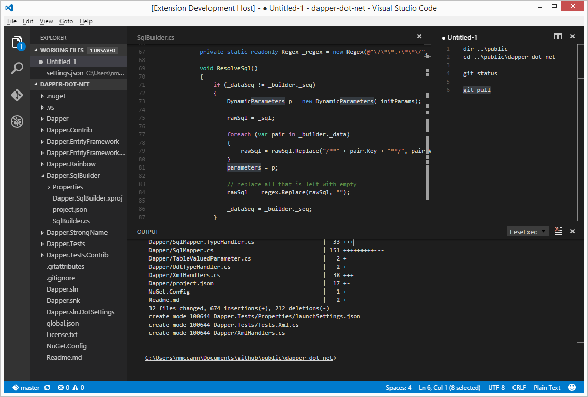

# EeseExec
## Run shell commands directly from the VSCode editor window
Two ways to execute commands

* Select the code you want to run and press `F4`
* Press `F4` with no text selected and an input box will pop up

The resulting output is sent to the Output window `Ctrl+Shift+U` under the **EeseExec** context. All commands are sent to a single cmd instance so state is preserved (ie current working directory).

